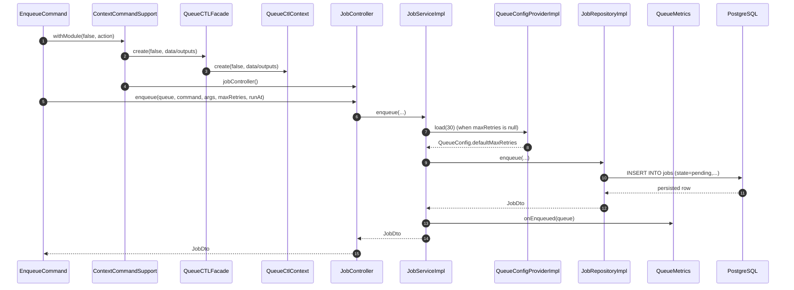
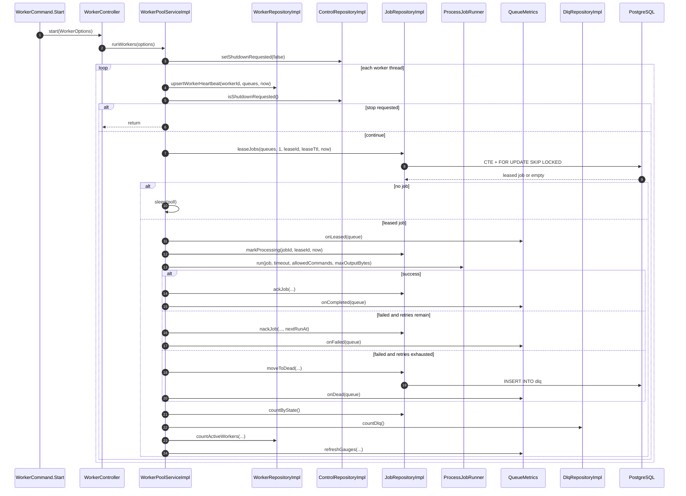
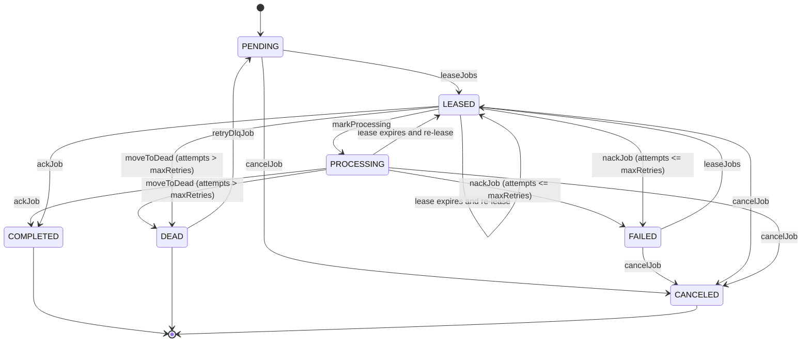

# queuectl LLD / UML

This document captures low-level UML diagrams from the current implementation across:

- `queuectl-cli`
- `queuectl-application`
- `queuectl-infra`
- `queuectl-domain`

## 1) Sequence Diagram - Enqueue Flow

## 2) Sequence Diagram - Worker Loop and Job Execution

## 3) State Diagram - Job Lifecycle

